<!-- Generated by GitHub Profile Agent Console. Edit profile.config.json, then run npm run generate. -->

  <picture>
    <source media="(max-width: 760px) and (prefers-color-scheme: dark)" srcset="./assets/hero/agent-console-96612e49-mobile-dark.svg">
    <source media="(max-width: 760px)" srcset="./assets/hero/agent-console-96612e49-mobile-light.svg">
    <source media="(prefers-color-scheme: dark)" srcset="./assets/hero/agent-console-96612e49-dark.svg">
    <source media="(prefers-color-scheme: light)" srcset="./assets/hero/agent-console-96612e49-light.svg">
    
  </picture>

  

## About Me

Full-Stack Web Developer with professional experience since 2022, specializing in Laravel, PHP, and Next.js to build scalable, secure, and maintainable web applications.

My work combines hands-on software engineering with a practical builder mindset: understanding real-world requirements, designing reliable architectures, building end-to-end solutions, and continuously improving systems in production.

## Current Focus

| Area | What I am exploring |
| --- | --- |
| **Full-Stack Dev** | Developing end-to-end web applications from backend architecture and database design to frontend interfaces, API integration, authentication, deployment, and maintenance. |
| **Laravel** | Specializing in Laravel and PHP for building scalable web applications, RESTful APIs, MVC-based systems, authentication, queue and job processing, caching, and databases. |
| **Backend Dev** | Designing and developing backend services using Laravel and PHP, with experience in RESTful APIs, database optimization, system integration, authentication, and background jobs. |
| **Architecture** | Applying software architecture principles to build maintainable systems with clear separation of responsibilities, reliable database structures, and secure authentication. |

## Featured Work

| Project | Focus | Why it matters |
| --- | --- | --- |
| [**Presensi Kuliah**](https://github.com/robisetiawan) | Full-Stack Academic System | Built a QR-code based attendance system for students, lecturers, and academic staff, covering attendance validation, schedule management, teaching records, reporting, and role-based access control. |
| [**OBE**](https://github.com/robisetiawan) | Academic Curriculum Management | Developed an Outcome-Based Education system for managing graduate profiles, CPL, CPMK, sub-CPMK mapping, curriculum structures, assessment, and evaluation workflows. |
| [**E-Voting System**](https://github.com/robisetiawan) | Payment & Transaction Integration | Developed an e-voting platform with an integrated voucher purchase and payment workflow using the Midtrans payment gateway, connecting voting, voucher, and transaction processes into a single system. |
| [**EnterPrime News**](https://github.com/robisetiawan) | Production News Platform | Contributed to the development and maintenance of a production news platform, implementing content management, article publishing, digital content delivery, and performance-oriented features. [Live](https://enterprimenews.com/) |

## Research Direction

I focus on building scalable web applications and integrated digital systems, with particular expertise in Laravel, backend development, API integration, databases, authentication, and modern frontend development using Next.js and React.

## Tech Stack

`Laravel` · `PHP` · `Next.js` · `React.js` · `JavaScript` · `Tailwind CSS` · `Bootstrap` · `SQL Server` · `MySQL` · `REST API` · `Linux` · `Apache` · `Nginx` · `Git` · `Docker`

## Recent Activity

<!-- AUTO:ACTIVITY:START -->
_Recent public activity will appear here after the workflow runs._
<!-- AUTO:ACTIVITY:END -->

---

  Building reliable web systems and sharing what works.

